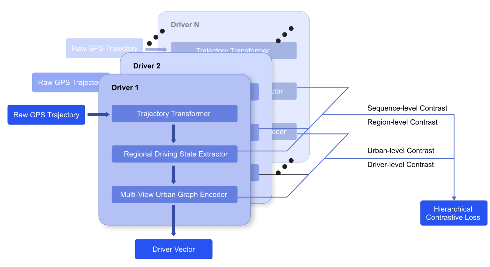

# HGCL

This repo is the implementation of our manuscript entitled **Region-Aware Hierarchical Graph Contrastive Learning for Ride-Hailing Driver Profiling**. The code is based on Pytorch 1.13.1, and tested on Ubuntu 18 with two NVIDIA Tesla V100 GPUs. 

In this study, we present a region-aware Hierarchical Graph Contrastive Learning (HGCL) model for ride-hailing driver profiling. The model consists of three modules: trajectory transformer, regional driving state extractor and multi-view urban graph encoder. Then obtained driver profiles can be used as extra features for various downstream tasks.


## Framework

||
|--|
|  |

## Requirements

HGCL uses the following dependencies: 

* [Pytorch 1.13.1](https://pytorch.org/get-started/locally/) and its dependencies
* Numpy
* torch_geometric 2.2.0 and its dependencies
* CUDA 11.3 or latest version, cuDNN.


## Dataset

The dataset is based on [Chengdu Taxi dataset](https://www.pkbigdata.com/common/zhzgbCmptDataDetails.html#down), with around 5000 taxi drivers. Since the overall dataset is extremely large, here we provide sample dataset with trajectories from 10 drivers.


## Arguments

- **stage**: training stage, within [traj, relation_graph, urban, total], to train the model layer by layer or end-to-end
- **batch_size**: training batch size
- **lr**: the learning rate
- **weight_decay**: the weight decay of the optimizer in Adam
- **seed**: random seed
- **hidden_dim**: the dimension of embeddings
- **epoch**: training epochs


## Model Training

Before training the model, you need to install the dependencies:

```shell
pip install -r requirements.txt
```

Then you can train the model with designated hyperparameters, for instance:

```shell
python main.py --mode 'train' --stage 'total' --lr 1e-3 --hidden_dim 64
```

